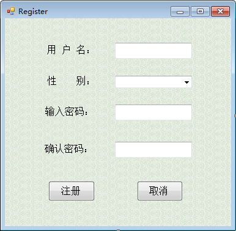
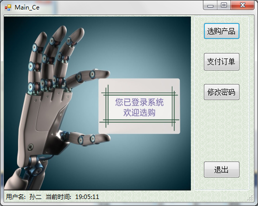
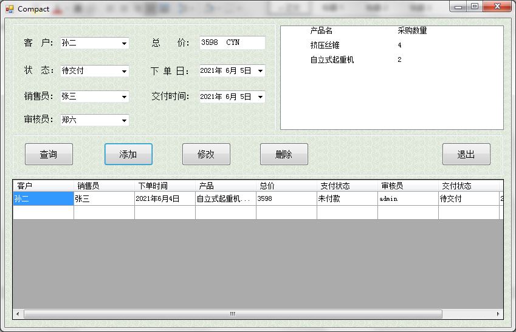

# 基于Windows系统零部件销售系统

## 一、软件版本(Version)：VS 2010, SQL Server 2008

不同版本兼容可能存在未知BUG。


## 二、注意事项(Matters needing attention)

在使用前你需要将数据库附加到你的电脑上，数据库文件在 `` Component-Sell/Data `` 下。

在运行之前你同样需要对项目内数据库连接配置进行修改。

文件配置在`` Component-Sell/Data_Class/SqlHelpers.cs ``下,修改对应信息。

``` c#
public string strcon = "data source=GREAT;initial catalog=XSXT;integrated security=true";
```

## 三、效果预览








